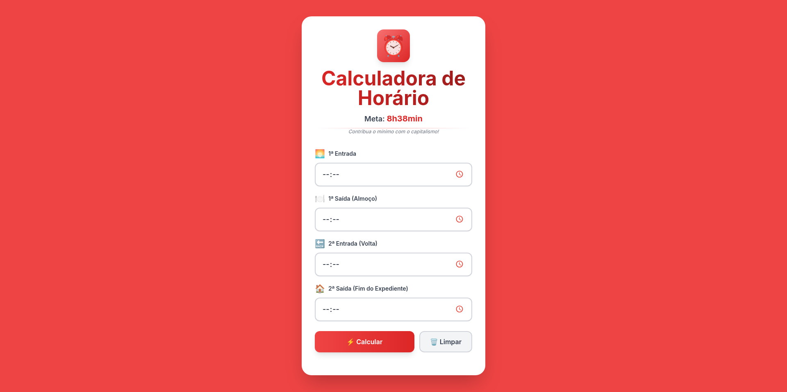

# ⏰ Calculadora de Ponto

Aplicação web moderna para calcular horários de trabalho e tempo de almoço, ajudando você a **contribuir o mínimo com o capitalismo** 😎


## 🎯 Sobre o Projeto

Calculadora intuitiva que ajuda a controlar seu horário de trabalho diário. Informe seus horários de entrada, saída para almoço e retorno, e a aplicação calcula automaticamente:

- ⏰ Horário ideal de saída para cumprir 8h38min
- 🍽️ Tempo total de almoço
- 📊 Total de horas trabalhadas

## ✨ Features

- 🎨 Interface moderna com design colorido em tons de vermelho
- 🌊 Animações suaves e transições fluidas
- 📱 Layout responsivo para mobile e desktop
- ⚡ Cálculo instantâneo com feedback visual
- 🧹 Botão de limpar campos
- 💫 Loading animation ao calcular

## 🛠️ Tecnologias Utilizadas

- **React** - Biblioteca para construção da interface
- **Vite** - Build tool ultrarrápido
- **Tailwind CSS** - Framework de estilização utilitária
- **JavaScript (ES6+)** - Lógica da aplicação

## 🚀 Como Executar Localmente

### Pré-requisitos

- Node.js (v16 ou superior)
- npm ou yarn

### Instalação

1. Clone o repositório:
```bash
git clone git@github.com:Larismontp/calculadora-ponto.git
```

2. Entre na pasta do projeto:
```bash
cd calculadora-ponto
```

3. Instale as dependências:
```bash
npm install
```

4. Execute o projeto:
```bash
npm run dev
```

5. Acesse no navegador:
```
http://localhost:5173
```

## 📁 Estrutura do Projeto
```
calculadora-ponto/
├── src/
│   ├── components/
│   │   ├── Header.jsx          # Cabeçalho da aplicação
│   │   ├── TimeInput.jsx       # Componente de input de horário
│   │   └── ResultCard.jsx      # Card com resultados
│   ├── utils/
│   │   └── timeCalculations.jsx # Lógica de cálculos
│   ├── App.jsx                  # Componente principal
│   ├── main.jsx                 # Entry point
│   └── index.css                # Estilos globais
├── public/
├── tailwind.config.js           # Configuração do Tailwind
├── vite.config.js               # Configuração do Vite
└── package.json
```


## 📸 Screenshots



## 🤝 Contribuindo

Contribuições são bem-vindas! Sinta-se à vontade para abrir issues ou enviar pull requests.

## 📝 Licença

Este projeto está sob a licença MIT.

## 👩‍💻 Autora

**Larissa Monteiro**

- GitHub: [@Larismontp](https://github.com/Larismontp)
- LinkedIn: [Larisdev](https://linkedin.com/in/Larisdev)

---

⭐ Se este projeto te ajudou, deixe uma estrela!